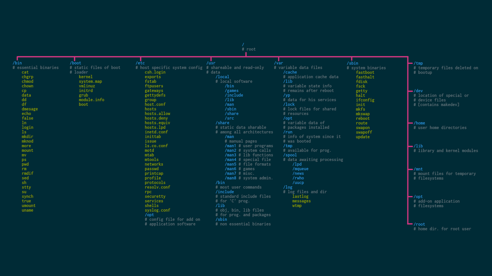

# navigate

`how to navigate the filesystem on our Linux system`

## Understanding the Filesystem Tree



- Linux organizes its files
  in what is called a hierarchical directory structure
- This means that they are organized in a tree-like pattern of directories (sometimes called folders in other systems)
- The first directory in the filesystem is called the root directory
- The root directory contains files and subdirectories, which contain more files and subdirectories
- Note that unlike Windows, which has a separate filesystem tree for each storage device
- Unix-like systems such as Linux always have a single filesystem tree, regardless of how many drives or storage devices are attached to the computer
- Storage devices are attached (or more correctly, mounted) at various points on the tree according to the whims of the system administrator, the person (or persons) responsible for the maintenance of the system.

## The Current Working Directory

- Imagine that the filesystem is a maze shaped like an upside-down tree and we are able to stand in the middle of it.
- we are inside a single directory and we can see the files contained in the directory and the pathway to the directory above us (called the parent directory) and any subdirectories below us
- The directory we are standing in is called the current working directory.
- To display the current working directory, we use the pwd (print working directory) command:

```sh
[me@linuxbox ~]$ pwd
/home/me
```

> Note: When we first log in to our system (or start a terminal emulator session), our current working directory is set to our home directory.

- Each user account is given its own home directory, which is the only place the user is allowed to write files when operating as a regular user.

## Listing the Contents of a Directory

To list the files and directories in the current working directory, we use the ls command:

```sh
[me@linuxbox ~]$ ls
Desktop Documents Music Pictures Public Templates Videos
```

## Changing the Current Working Directory

- To change your working directory (where we are standing in our treeshaped maze) we use the cd command: Type cd followed by the pathname of the desired working directory.

- A pathname is the route we take along the branches of the tree to get to the directory we want.

- Pathnames can be specified in one of two ways, as absolute pathnames or as relative pathnames.

### Absolute Pathnames

`An absolute pathname begins with the root directory and follows the tree branch by branch until the path to the desired directory or file is completed`

EX:<br>
_there is a directory on your system in which most of
your system’s programs are installed. The pathname of that directory is
/usr/bin. This means from the root directory (represented by the leading
slash in the pathname) there is a directory called usr that contains a directory called bin._

```sh
[me@linuxbox ~]$ cd /usr/bin
[me@linuxbox bin]$ pwd
/usr/bin
[me@linuxbox bin]$ ls
...Listing of many, many files ...
```

> Note: how the shell prompt has changed? <br> _As a convenience, it is usually set up to automatically display the name of the working directory_

### Relative Pathnames

`Where an absolute pathname starts from the root directory and leads to its destination, a relative pathname starts from the working directory`

- it uses a couple of special symbols to represent relative positions in the filesystem tree. These special symbols are . (dot) and .. (dot dot).
- The . symbol refers to the working directory and the .. symbol refers to the working directory’s parent directory.

```shell
# change the working directory to /usr/bin

[me@linuxbox ~]$ cd /usr/bin
[me@linuxbox bin]$ pwd
/usr/bin

# Okay, now let’s say that we wanted to change the working directory to the parent of /usr/bin, which is /usr. We could do that two different ways, either with an absolute pathname:

[me@linuxbox bin]$ cd /usr
[me@linuxbox usr]$ pwd
/usr

# or with a relative pathname:
[me@linuxbox bin]$ cd ..
[me@linuxbox usr]$ pwd
/usr
```

> Two different methods produce identical results. Which one should we use? <br> _The one that requires the least typing!_

> Note: <br> , there is something important that I must point out here. In almost all cases, you can omit the ./ because it is implied. Typing `[me@linuxbox usr]$ cd bin`

### Some Helpful Shortcuts

| Shortcut     |                                                                    Result                                                                     |
| ------------ | :-------------------------------------------------------------------------------------------------------------------------------------------: |
| cd           |                                             Changes the working directory to your home directory.                                             |
| cd -         |                                   Changes the working directory to the previous working directory. centered                                   |
| cd ~username | Changes the working directory to the home directory of username. For example, cd ~bob changes the directory to the home directory of user bob |

## IMPORTANT FACTS ABOUT FILENAMES

- In Unix-like systems, files starting with a dot (.) are hidden and won't show up unless you use "ls -a". Hidden files are automatically created when you create a user account and by some applications to store settings. These files are important for customizing your environment.

- Filenames and commands in Linux, as in Unix, are case sensitive. The filenames File1 and file1 refer to different files

- Linux has no concept of a “file extension” like some other operating systems. You may name files any way you like. The contents and/or purpose of a file is determined by other means. Although Unix-like operating systems don’t use file extensions to determine the contents/purpose of files, some application programs do

- In Linux, it's best to limit the use of punctuation characters in filenames to period, dash (hyphen) This is because some punctuation characters have special meanings in the Linux shell and can cause problems when used in filenames., and underscore. Avoid embedding spaces in filenames as it can make command line tasks more difficult. Instead, use underscore characters to represent spaces between words in a filename. This will make things easier in the long run
